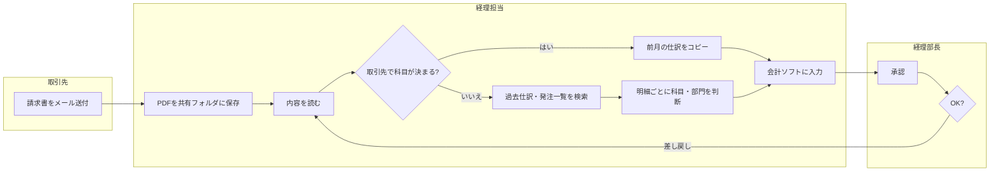

# 02 現状業務（As-Is）の把握

[← 目次へ](./README.md) ｜ 前：[01 キックオフ](./01-kickoff.md)

> **この章のゴール**
> - 「どの仕訳の、どの作業に、どれだけ時間がかかっているか」を **数字で** 示せる
> - 「ルールで解ける部分」と「AI（LLM）が必要な部分」を切り分けられる
> - PoCの対象を、根拠をもって絞り込める

---

## 1. 全体の流れ

```
(1) ヒアリング          … 担当者に話を聞く（何をしているつもりか）
(2) 業務観察・時間計測    … 実際の作業を横で見て測る（本当は何をしているか）
(3) 過去データの集計     … 仕訳データを数えて、パターンを定量化する
(4) 業務フロー図・棚卸し  … 図と表にまとめ、顧客にレビューしてもらう
(5) 対象の絞り込み       … 件数 × 難しさ × 効果で優先順位をつける
```

**(1)だけで終わらせないこと。** 聞いた話と実際の作業はかなり違います。
「取引先を見れば科目は分かる」と言っていた担当者が、実際には毎回過去の仕訳を検索していた、はよくある話です。

---

## 2. ヒアリング

### 進め方

- 1回60〜90分、相手は実務担当者1〜2名。PM（またはリーダー）が聞き役、**新人は記録係**
- **実物を見ながら聞く**：「最近処理した請求書を3枚見せてください」から始めると話が具体的になる
- 録音の可否を最初に確認する

### 質問リスト（このまま使える）

[templates/hearing-sheet.md](./templates/hearing-sheet.md) にコピー用のシートがあります。

**A. 業務の流れ**
1. 証憑はどこから、どんな形で届きますか？（紙・PDF・メール・システム）
2. 届いてから会計ソフトに入るまで、誰が何をしますか？ 順番に教えてください
3. 承認は誰が、何を見てしていますか？ 差し戻しはどのくらいありますか？
4. 月のうち、忙しいのはいつですか？ その時期は何に時間を取られていますか？

**B. 判断のしかた（ここが一番大事）**
5. 勘定科目はどうやって決めていますか？（取引先で決まる／明細を見て決める／過去の仕訳を検索する／先輩に聞く）
6. 部門はどうやって決めていますか？（発注者で決まる／請求書に書いてある／按分ルールがある）
7. 税区分で迷うのはどんなときですか？
8. 判断に迷ったとき、何を見て・誰に聞いていますか？ **その「何か」を見せてもらえますか？**（経理規程、Excelの対応表、引き継ぎメモなど）
9. 新しく入った人が最初によく間違えるのは、どんな仕訳ですか？
10. 「この取引先は要注意」というものはありますか？ なぜですか？

**C. 例外・イレギュラー**
11. 毎回処理が違う、面倒な請求書はどんなものですか？ 月に何件くらいですか？
12. 明細を分けて入力しているのはどんなケースですか？
13. 源泉徴収、前払、按分、外貨の処理はどのくらいありますか？
14. 決算月や期首だけの特殊な処理はありますか？

**D. 品質**
15. 月次チェックで見つかる誤りで多いのはどんなものですか？
16. 誤りが見つかったとき、どう直していますか？ 直すのにどのくらいかかりますか？
17. 過去に「これは大きな問題になった」という誤りはありますか？（＝AIが絶対に間違えてはいけない種類の誤り）

**E. システム**
18. 会計ソフトへはどう入れていますか？（画面入力／CSV取込／他システム連携）
19. 仕訳を入れるときに、他に見ている画面やファイルはありますか？
20. 取引先マスタ・科目マスタは誰が管理していますか？ どのくらいの頻度で変わりますか？

### 聞き方のコツ

| NGな聞き方 | 良い聞き方 | 理由 |
|---|---|---|
| 「科目の判断は難しいですか？」 | 「昨日処理した中で、一番迷った1件を見せてもらえますか？」 | 抽象的な質問には「普通です」としか返ってこない |
| 「AIで自動化できそうな作業はありますか？」 | 「やらなくて済むなら一番嬉しい作業は何ですか？」 | 相手はAIで何ができるか知らない。困りごとを聞く |
| 「ルールはありますか？」 | 「新人さんに教えるとき、どう説明していますか？」 | 暗黙のルールは「ルール」と認識されていない |
| （黙って聞く） | 「つまり○○ということですね？」と言い換えて確認 | 理解のズレをその場で潰す |

---

## 3. 業務観察と時間計測

### なぜ測るのか

- KPIの **今の値（ベースライン）** がないと、効果を証明できない
- 「どの作業」に時間がかかっているかで、打ち手が変わる

### やり方

1. 担当者の横に座り（またはリモートで画面共有してもらい）、通常どおり処理してもらう
2. **30〜50件** を目安に、1件ごとに作業を区切って時間を記録する
3. 作業を次の5つに分けて記録する

| 作業区分 | 内容 | 例 |
|---|---|---|
| ①読む | 証憑を開いて内容を確認する | PDFを開く、明細を読む |
| ②調べる | 判断のために他の情報を見る | 過去の仕訳を検索、Excelの対応表、発注者に問い合わせ |
| ③判断する | 科目・部門・税区分を決める | （頭の中での判断。②と合わせて計測でもよい） |
| ④入力する | 会計ソフトに打ち込む | 画面入力、摘要の記入 |
| ⑤確認する | 入力後の見直し、承認者の確認 | 金額の照合、承認 |

### 記録シート（例）

| # | 証憑の種類 | 取引先 | 明細行数 | ①読む | ②調べる | ④入力 | ⑤確認 | 合計 | メモ |
|---|---|---|---|---|---|---|---|---|---|
| 1 | 請求書PDF | クラウド会社A | 1 | 10秒 | 0秒 | 40秒 | 10秒 | 60秒 | 毎月同じ、前月コピー |
| 2 | 請求書PDF | 事務用品通販B | 18 | 60秒 | 120秒 | 300秒 | 60秒 | 540秒 | 明細ごとに部門を発注一覧で確認 |
| 3 | 請求書紙 | 個人デザイナーC | 1 | 20秒 | 90秒 | 60秒 | 30秒 | 200秒 | 源泉の要否を前回の仕訳で確認 |

> **注意**：観察されていると普段より丁寧・速くなりがちです（ホーソン効果）。
> 可能なら、担当者自身に1週間分の簡易ログ（件数と、おおよその時間）を付けてもらうと補正できます。

### みどり物産での結果（例）

| 型 | 件数/月 | 1件平均 | 月の合計時間 | 時間の内訳で多いもの |
|---|---|---|---|---|
| 毎月定額の請求書（型A） | 900 | 1.0分 | 15時間 | 入力 |
| 取引先固定・内容ほぼ固定 | 800 | 1.5分 | 20時間 | 入力 |
| **明細が多く毎回違う（型D）** | 500 | **7.0分** | **58時間** | **調べる・入力** |
| 税率混在・按分あり（型C・H） | 200 | 4.0分 | 13時間 | 判断 |
| 源泉・前払・外貨など特殊（型F・G・I） | 100 | 6.0分 | 10時間 | 調べる |
| **計** | **2,500** | | **116時間** | |

→ **件数は20%しかない型Dが、時間の50%を占めている。**
→ 型Aは件数が多いが、すでに速い。ここをAI化しても効果は小さい。

---

## 4. 過去データの集計（数字で裏付ける）

ヒアリングと観察は件数が少ないので、**過去の仕訳データ（12か月分程度）** で全体像を確かめます。
データの貰い方は [03 データと評価の設計](./03-data-and-eval.md) を参照。

### 必ず出す集計

| 集計 | 何が分かるか | やり方のヒント |
|---|---|---|
| 取引先別の件数（上位から並べる） | 少数の取引先で大半を占めるか | 上位20社で何%かを見る |
| **取引先ごとの科目の種類数** | 「取引先で科目が決まる」割合 | 取引先ごとに使われた科目のユニーク数を数える。1種類なら「取引先で決まる」 |
| 取引先ごとの部門の種類数 | 部門が取引先で決まるか | 同上 |
| 1請求書あたりの明細行数の分布 | 明細の多い請求書がどれだけあるか | 1行 / 2〜5行 / 6〜20行 / 21行以上 で数える |
| 税区分の分布 | 軽減税率・非課税・免税事業者の多さ | |
| 新規取引先の月あたり件数 | 過去データが使えない割合 | 前月までに出てこない取引先を数える |
| 摘要の書き方のパターン | 摘要の自動生成が必要か | 上位の摘要を眺める |

### 「ルールで解ける割合」を見積もる

```
取引先ごとに、過去12か月で使われた（科目, 部門, 税区分）の組み合わせが
 ・1種類だけ                     → 「前回と同じ」ルールでほぼ当たる
 ・2〜3種類（ただし金額や時期で決まる） → ルール＋少しの条件で当たる
 ・4種類以上、または明細で決まる        → AI（LLM）の出番
 ・過去にない（新規取引先）            → AI（LLM）の出番、ただし難易度高
```

みどり物産の例：

| 区分 | 件数割合 |
|---|---|
| 1種類だけ（ルールで当たる） | 58% |
| 2〜3種類（条件付きルール） | 14% |
| 4種類以上・明細で決まる | 24% |
| 新規取引先 | 4% |

→ **AIを本当に使うべきなのは全体の約3割**。残り7割はルールや既存機能で足りる可能性が高い。
これは LayerX の「AI明細仕訳」の発想と同じです：取引先単位の過去仕訳補完で解ける部分は解き、**明細が多く毎回内容が変わる請求書** にAIを使う。

> 参考：LayerX の経費科目推薦の記事では、科目や内訳が **会社ごとに自由に設定される** ため、単純な分類問題ではなく推薦（ランキング）問題として設計しています。
> 「科目マスタが会社ごとに違う」ことは、汎用のAIをそのまま当てても合わないことを意味します。

---

## 5. 業務フロー図と棚卸しシート

### 業務フロー図（スイムレーン形式）

縦に「人・システム」、横に「時間の流れ」を書きます。ツールは何でもよい（Excel、PowerPoint、draw.io、Mermaid など）。



**書くときのポイント**
- 判断の分岐（◇）を必ず書く。**分岐の条件こそがAIに学ばせるべき知識**
- 「調べる」作業で参照している資料（Excel、メール、人）を書き込む
- 差し戻しのループを書く

### 業務棚卸しシート

[templates/process-inventory.csv](./templates/process-inventory.csv) を使います。業務を型ごとに1行にして、件数・時間・難しさ・判断の根拠を並べます。

---

## 6. 対象の絞り込み（優先度マトリクス）

```
            効果（削減できる時間）
              大
               │  ★最優先           ○次に検討
               │  型D：明細多・毎回違う  型F/G/I：特殊
               │
   難しい ─────┼────────── 易しい
   （AI必須）  │
               │  △後回し            ◎既存機能・ルールで
               │  新規取引先のみ       型A：毎月定額
              小
```

**判断のしかた**

| 区分 | 方針 |
|---|---|
| 効果大・易しい | AIを使わずにルールや既存機能（会計ソフトの自動仕訳、前月コピー）で解決。**すぐ提案できる「クイックウィン」** |
| 効果大・難しい | **PoCの主対象**。ここでAIの価値を示す |
| 効果小・易しい | ついでにルール化 |
| 効果小・難しい | 今回は対象外。人が処理する |

みどり物産では：
- **PoC主対象**：明細の多い請求書（型D）と税率混在・按分（型C・H）＝ 月700件・71時間
- **クイックウィン**：毎月定額の請求書は会計ソフトの定型仕訳機能で処理（AI不要）
- **対象外**：源泉・前払・外貨（件数が少なく判断が重い。AIは「要確認」フラグを立てるだけにする）

---

## 7. 新人のタスク

- [ ] ヒアリングの記録係。当日中に「質問 → 回答 → 気づき」形式でまとめる
- [ ] 業務観察の時間計測（30〜50件）と集計
- [ ] 過去データの集計（上記の必須集計）
- [ ] 業務フロー図のドラフト作成 → PMレビュー → 顧客レビュー
- [ ] 業務棚卸しシートの作成
- [ ] 「担当者が判断に使っている資料」（経理規程、対応表Excelなど）の収集と一覧化

---

## 8. 注意点

- **聞いた話だけで設計しない。実物（証憑・仕訳データ・作業）を見る。**
- **平均だけで判断しない。** 「1件平均2.8分」でも、型ごとに分けると1分と7分の世界が混ざっています。
- **暗黙知を取りこぼさない。** 「Bさんに聞けば分かる」は属人化のサイン。その判断ルールこそ文書化してAIに渡すべき知識です。
- **担当者を評価しているように見せない。** 時間計測は「業務を測る」ためであって「人を測る」ためではない、と最初に伝える。
- **クイックウィンは正直に伝える。** 「この部分はAIを使わなくても会計ソフトの機能で解決できます」と言えるベンダーは信頼されます。

---

## 完了チェック

- [ ] 業務フロー図を顧客の実務担当者がレビューし、「合っている」と言ってもらった
- [ ] 型ごとの件数・1件あたり時間・月間合計時間の表がある
- [ ] 「ルールで解ける割合」と「AIが必要な割合」を数字で示せる
- [ ] 担当者が判断に使っている資料を入手した
- [ ] PoCの対象を、優先度マトリクスの根拠つきで顧客と合意した
- [ ] 「AIが絶対に間違えてはいけない誤り」を聞き出した

---

[← 前：01 キックオフ](./01-kickoff.md) ｜ [次へ：03 データと評価の設計 →](./03-data-and-eval.md)
