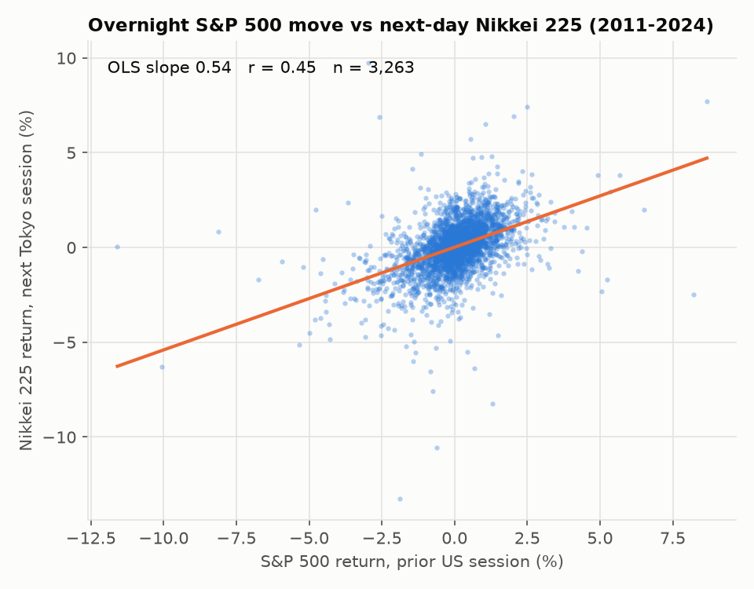
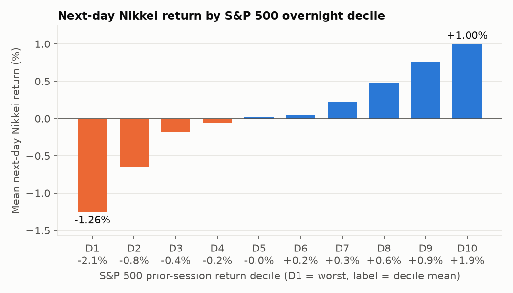
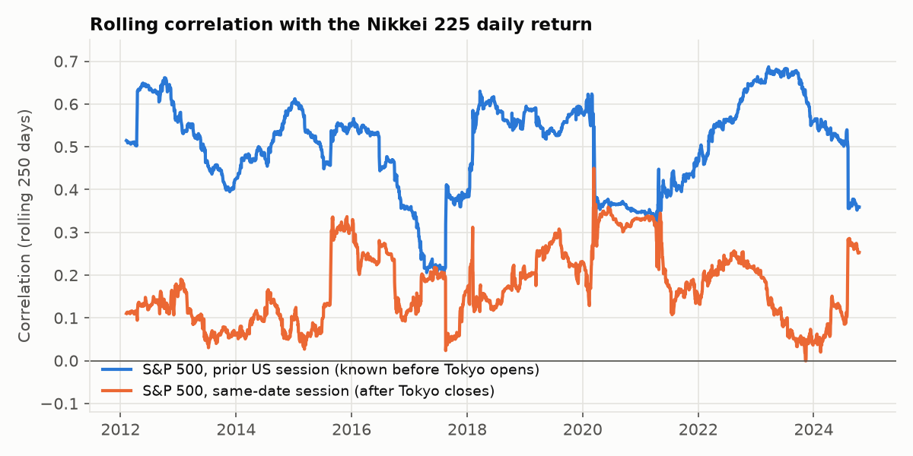
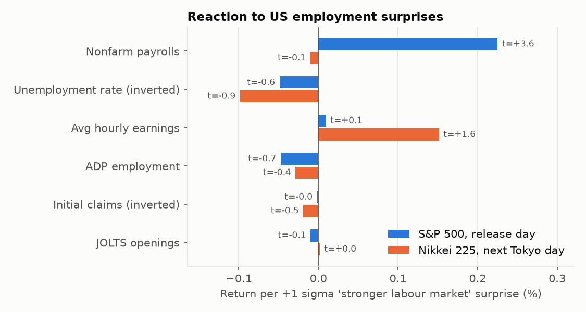
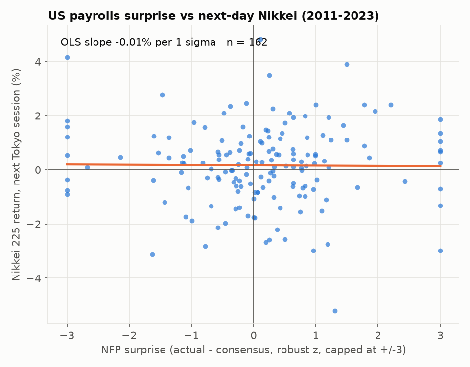

# 米国の雇用指標・株価指数と翌日の日本株（日経225）の関係

米国市場で起きたこと（株価の動き・雇用統計の結果）が、**翌営業日の日経平均**にどう効くかを
2011〜2024年の日次データで調べた分析です。

## 結論（先に要約）

| 問い | 答え |
|---|---|
| 前夜のS&P500/NASDAQは翌日の日経に効くか | **強く効く。** 相関 0.45、β≈0.54（S&Pが1%動くと日経は平均0.54%同方向）。方向一致率66%、S&Pが±2%超動いた日は84%。 |
| その影響はいつ織り込まれるか | **ほぼ寄り付き（ギャップ）で織り込まれる。** 寄付ギャップの方向一致率76%（R²=0.43）に対し、寄付→大引けは方向一致率49%で、ほぼランダム。 |
| 米雇用統計（NFP）のサプライズは翌日の日経に効くか | **全期間では有意な関係なし**（β≈0、t=−0.1）。米国株（t=3.6）やドル円（t=3.1）は当日に反応するが、日経への影響は「米国株・ドル円の動き」を経由した間接的なものにとどまる。 |
| その他の雇用指標（失業率・平均時給・ADP・新規失業保険申請・JOLTS） | いずれも翌日の日経に対して統計的に有意な効果なし（最大でも平均時給 t=1.6）。 |
| 時期による違い | NFPが「強い＝株高」だったのは2011〜2019年（S&P t=3.8、日経 β=+0.27%/σ）。2021〜2023年のインフレ局面では符号が逆転（日経 β=−0.14%/σ）し、「良い雇用統計＝利上げ懸念＝株安」の構図に変わった。 |

**実務的な含意:** 日本株の翌日の方向を予想するなら、雇用統計の数字そのものより
「前夜の米国株の終値（とドル円）」を見るほうがはるかに情報量が多い。
ただしその情報は寄り付きでほぼ価格に織り込まれるため、現物の寄り付き以降で使える
「エッジ」はほとんど残らない（夜間の日経先物では話が別）。

---

## 1. 前夜の米国株 → 翌日の日経225



| モデル（被説明変数＝日経の対数リターン） | N | 相関 | β | t値 | R² | 方向一致率 |
|---|---:|---:|---:|---:|---:|---:|
| S&P500（前夜）→ 日経（前日終値→当日終値） | 3,263 | 0.45 | 0.54 | 15.0 | 0.21 | 66.3% |
| NASDAQ（前夜）→ 日経（同上） | 3,263 | 0.44 | 0.45 | 16.3 | 0.20 | 66.0% |
| S&P500（前夜）→ 日経 **寄付ギャップ**（前日終値→当日始値） | 3,263 | **0.65** | 0.48 | 23.2 | **0.43** | **75.6%** |
| S&P500（前夜）→ 日経 **日中**（当日始値→終値） | 3,263 | 0.07 | 0.06 | 2.3 | 0.01 | 49.2% |
| S&P500 + ドル円（前夜）→ 日経 | 3,263 | – | S&P 0.51 / 円安 0.34 | 14.0 / 6.4 | 0.23 | – |
| 〔参考〕同じ日付の米国セッション（東京の引け後）→ 日経 | 3,126 | 0.18 | 0.23 | 6.2 | 0.03 | 54.8% |

*t値は不均一分散に頑健な標準誤差（HC1）で計算しています。*

- 前夜の米国株の動きだけで日経の日次変動の約2割を説明できる。ドル円（円安＝プラス）を足すとR²は0.23に上がる。
- 寄付ギャップでは相関が0.65まで上がる一方、日中の値動きとはほぼ無関係。**米国株の情報は寄り付きの時点でほぼ織り込み済み**ということ。
- 〔参考〕行は時間的に「後」に起きる米国セッションとの相関です。0.18と低く、上の0.45が単なる同時期の世界共通ショックではなく、**米国→日本という時間の向きを持った波及**であることを裏付けています。

### 前夜のS&P500のリターン十分位別に見た翌日の日経



| S&P500十分位 | S&P500平均 | 翌日日経平均 | 翌日日経の上昇確率 |
|---|---:|---:|---:|
| D1（最も下落） | −2.10% | −1.26% | 14.7% |
| D2 | −0.80% | −0.65% | 27.0% |
| D5 | −0.00% | +0.03% | 52.3% |
| D9 | +0.95% | +0.77% | 79.4% |
| D10（最も上昇） | +1.89% | +1.00% | 82.6% |

関係はほぼ単調で、下落側の反応（D1: −1.26%）が上昇側（D10: +1.00%）よりやや大きい傾向があります。

### 時期による変化



年次の相関は0.31（2024）〜0.67（2022）。2017年後半、2020〜21年、2024年8月以降（円キャリー巻き戻し）で連動性が低下しています。全体として **連動は常に存在するが強さは局面で変わる**。年別の数値は [`results/market_linkage_by_year.csv`](results/market_linkage_by_year.csv) を参照。

## 2. 米国の雇用指標のサプライズ → 翌日の日経225

**サプライズ** = 実績値 − 市場予想（Forex Factoryのコンセンサス）。指標ごとに頑健なzスコア（MADでスケーリング、±3でクリップ）に変換し、
符号は「雇用が予想より強い」をプラスにそろえています（失業率と新規失業保険申請は符号を反転）。
発表日（米国時間）の翌東京営業日の日経リターンと比べます。NFPは金曜発表なので、日経側は通常は月曜です。



| 指標 | N | 日経 β（%/1σ） | t | 2020年除外 t | 前夜S&Pを制御した t | S&P500 β（t） | ドル円 β（t） |
|---|---:|---:|---:|---:|---:|---:|---:|
| 非農業部門雇用者数（NFP） | 162 | −0.01 | −0.1 | 0.2 | −2.0 | **+0.23（3.6）** | **+0.13（3.1）** |
| 失業率（反転） | 162 | −0.10 | −0.9 | −1.2 | −0.5 | −0.05（−0.6） | −0.05（−1.1） |
| 平均時給 前月比 | 162 | +0.15 | 1.6 | 1.9 | 1.7 | +0.01（0.1） | +0.06（1.4） |
| ADP雇用者数 | 161 | −0.03 | −0.4 | −0.4 | 0.0 | −0.05（−0.7） | +0.01（0.3） |
| 新規失業保険申請（反転） | 688 | −0.02 | −0.5 | 0.2 | −0.5 | −0.00（−0.0） | +0.03（1.5） |
| JOLTS求人件数 | 141 | +0.00 | 0.0 | 0.0 | 0.1 | −0.01（−0.1） | −0.00（−0.0） |



読み取れること:

1. **NFPは米国株とドル円を動かすが、翌日の日経には直接の効果が見えない。**
   NFPが予想より1σ強いとS&P500は+0.23%、ドル円は+0.13%（円安）。日経の係数はほぼゼロ。
2. **前夜のS&P500を制御すると、NFPの係数はむしろマイナス（t=−2.0、境界的）。**
   日経は米国株の動きには追随するが、そのうち「雇用統計による部分」には米国株ほど反応しない、とも読めます。ただし有意性は境界的です。
3. **発表翌日のボラティリティ:** NFP翌日の日経の絶対リターンは平均1.11%、ほかの月曜日は1.03%。差は統計的に有意ではありません（Mann-Whitney p=0.30）。
4. **局面で符号が変わる（NFP）:**

| 期間 | N | 日経 β（%/1σ） | t | S&P500 β（%/1σ） | t |
|---|---:|---:|---:|---:|---:|
| 2011–2019 | 112 | +0.27 | 1.5 | **+0.47** | **3.8** |
| 2020（コロナ） | 12 | −0.12 | −0.5 | +0.27 | 1.8 |
| 2021–2023 | 38 | −0.14 | −1.3 | +0.07 | 0.9 |

   低インフレ期は「雇用が強い＝景気が良い＝株高」でしたが、2021年以降は「雇用が強い＝FRBの利上げ継続＝株安」の力が加わり、効果が打ち消されるか逆転しています。全期間でゼロに見えるのは、この相反する二つの局面が平均された結果でもあります。

## 3. 方法

### データ（2011年1月〜2024年10月）

| 系列 | 内容 | 出所 |
|---|---|---|
| 日経225 | 日次 始値・終値 | [nikhilchandra-stats/asset_data](https://github.com/nikhilchandra-stats/asset_data)（Investing.com形式） |
| NASDAQ総合 | 日次 終値 | 同上 |
| USD/JPY | 日次 終値 | 同上 |
| S&P500 | 日次 終値 | [SteelCerberus/us-market-data](https://github.com/SteelCerberus/us-market-data)（FRED / Yahoo Finance 由来） |
| 米経済指標 | 実績値・予想値（2010〜2023） | [spoluan/forex-factory-scraper](https://github.com/spoluan/forex-factory-scraper)（Forex Factory カレンダー） |

> 分析環境のネットワーク制限で FRED / Yahoo Finance / BLS に直接アクセスできなかったため、それらを元データとする GitHub 上の公開データセットを使っています。
> 雇用指標のイベント分析は、カレンダーデータの範囲（〜2023年12月）までです。

### 日付の対応付け（ルックアヘッドの回避）

- 米国の取引日Dのセッション（NY 16:00 引け）は、翌カレンダー日の東京セッション（9:00 寄付）より**前に**終わります。
- 東京の各営業日Jについて、「前回の東京の引け以降〜Jの前日まで」に日付がある米国セッションの累積リターンを「前夜の米国」としています。東京の祝日をまたぐ場合（米国が2セッション以上動いた場合）もこの累積で扱います。
- 雇用統計（米東部 8:30 発表、日付D）は、D より後の最初の東京営業日に対応させています。
- リターンはすべて対数リターン、回帰のt値は不均一分散に頑健な標準誤差（HC1）です。

### 注意点

- 相関・回帰による分析で、因果を厳密に識別したものではありません（ただし時間の前後関係は担保しています）。
- Investing.com の始値は一部でデータ品質に問題がある可能性があります（|ギャップ| > 20% の異常値は除外済み）。
- コンセンサス予想は Forex Factory の値で、Bloomberg 等の調査値とは若干異なる可能性があります。
- NFP の「実績値」は速報値です（その後の改定は反映していません。市場が反応するのは速報値なので、これは意図どおりです）。

## 4. 再現方法

```bash
cd us_jp_market_analysis
pip install -r requirements.txt
python src/fetch_data.py   # data/raw/ に元データをダウンロード（git管理外）
python src/analysis.py     # results/ に表、figures/ に図を出力
```

| 出力ファイル | 内容 |
|---|---|
| `results/daily_panel.csv` | 東京営業日ごとの日経リターンと、対応する前夜の米国・ドル円リターン |
| `results/market_linkage.csv` | 第1節の回帰結果 |
| `results/market_linkage_by_year.csv` | 年別の相関・β |
| `results/nikkei_by_sp500_decile.csv` | 十分位別の集計 |
| `results/employment_event_study.csv` | 第2節の雇用指標イベント分析 |
| `results/nfp_by_period.csv` | NFP の期間別分析 |
| `results/nfp_events.csv` | NFP 各回のサプライズと市場反応 |
| `results/console_output.txt` | `analysis.py` の標準出力 |
